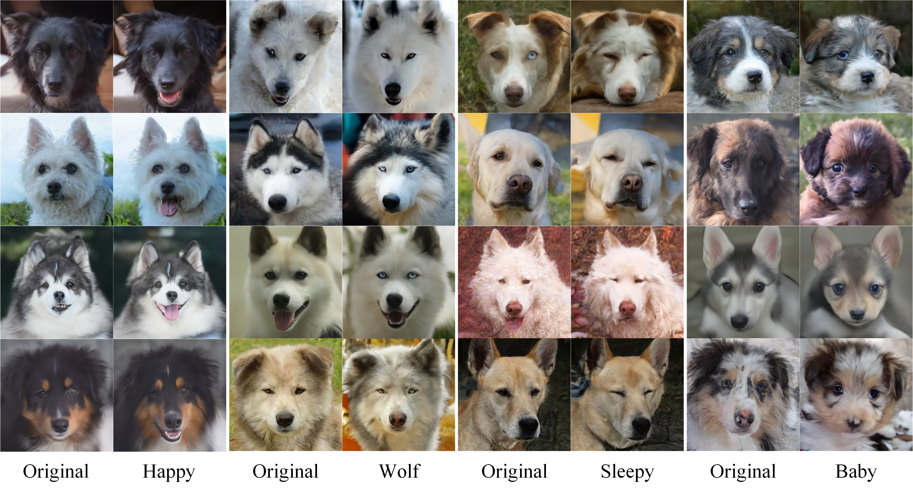

# Dual-Space Guided High-Fidelity Image Attribute Editing with Diffusion Models
## Description

This repo includes the official Pytorch implementation of our **DGHE**.


## Getting Started

We recommend running our code using NVIDIA GPU + CUDA, CuDNN.

## Pretrained Models for DGHE

DGHE works on the checkpoints of pretrained diffusion models.


| Image Type to Edit | Size    | Pretrained Model                                             | Dataset                                       | Reference Repo.                                           |
| ------------------ | ------- | ------------------------------------------------------------ | --------------------------------------------- | --------------------------------------------------------- |
| Human face         | 256×256 | Diffusion (Auto)                                             | [CelebA-HQ](https://arxiv.org/abs/1710.10196) | [SDEdit](https://github.com/ermongroup/SDEdit)            |
| Human face         | 256×256 | [Diffusion](https://1drv.ms/u/s!AkQjJhxDm0Fyhqp_4gkYjwVRBe8V_w?e=Et3ITH) | [CelebA-HQ](https://arxiv.org/abs/1710.10196) | [P2 weighting](https://github.com/jychoi118/P2-weighting) |
| Church             | 256×256 | Diffusion (Auto)                                             | [Church](https://www.yf.io/p/lsun)            | [SDEdit](https://github.com/ermongroup/SDEdit)            |
| Dog face           | 256×256 | [Diffusion](https://1drv.ms/u/s!AkQjJhxDm0Fyhqp_4gkYjwVRBe8V_w?e=Et3ITH) | [AFHQ-Dog](https://arxiv.org/abs/1912.01865)  | [ILVR](https://github.com/jychoi118/ilvr_adm)             |

- The pretrained Diffuson models on 256x256 images in [CelebA-HQ](https://arxiv.org/abs/1710.10196), [LSUN-Church](https://www.yf.io/p/lsun), and [AFHQ-Dog](https://arxiv.org/abs/1912.01865) are automatically downloaded in the code. (codes from [DiffusionCLIP](https://github.com/gwang-kim/DiffusionCLIP))
- You can manually revise the checkpoint paths and names in the `./configs/paths_config.py` file.

## Pretrained Checkpoints

| Path                                                         | Description                                                  |
| ------------------------------------------------------------ | :----------------------------------------------------------- |
| [Human face](https://drive.google.com/drive/folders/1I2_zilf3mPq1vKMRRuOd5qA7iW_hTUGp?hl=zh_CN) | DGHE trained on the [CelebA-HQ](https://arxiv.org/abs/1710.10196) dataset. |
| [Church](https://drive.google.com/drive/folders/1PDsLFANHH6DMRvv3SVYaVv9t8QvZrJci?hl=zh_CN) | DGHE trained on the [Church](https://www.yf.io/p/lsun) dataset. |
| [Dog face](https://drive.google.com/drive/folders/1Ss7Uwsl5q_bpCiS2qxfZP4q5eDX0VFaR?hl=zh_CN) | DGHE trained on the [Afhq-Dog](https://arxiv.org/abs/1912.01865) dataset. |

## Training Model

To train the DGHE, run the following commands using `script_train.sh`

+ ```
  python main.py --run_train                              \
      --config $config                                    \
      --exp ./runs/train/$guid                            \
      --edit_attr $guid                                   \
      --do_train 1                                        \
      --do_test 1                                         \
      --n_train_img 80                                    \
      --n_test_img 100                                    \
      --n_iter 1                                          \
      --bs_train 1                                        \
      --t_0 999                                           \
      --n_inv_step 40                                     \
      --n_train_step 40                                   \
      --n_test_step 40                                    \
      --get_h_num 1                                       \
      --train_delta_block                                 \
      --sh_file_name $sh_file_name                        \
      --save_x0                                           \
      --use_x0_tensor                                     \
      --hs_coeff_delta_h 1.0                              \
      --lr_training 0.5                                   \
      --clip_loss_w 0.8                                   \
      --l1_loss_w 2.658                                   \
      --retrain 1                                         \
      --add_noise_from_xt                                 \
      --lpips_addnoise_th 1.2                             \
      --lpips_edit_th 0.33                                \
      --model_path "diffusion model path"                 \
      --gan_model_path "gan inversion model path"         \
      --save_precomputed_images                           \
      --save_x_origin                                     \
      --mysig 0.5                                         \
      --gan_edit                                          \
      --save_src_and_gen                                  \
  ```

## Inference

After training, you can inference using `script_inference.sh`. We provide some of it in the Pretrained Checkpoints.

+ ```
  python main.py --run_test                               \
      --config $config                                    \
      --exp ./runs/test/gan_edit/$guid                    \
      --edit_attr $guid                                   \
      --do_train 0                                        \
      --do_test 1                                         \
      --n_train_img 0                                     \
      --n_test_img 300                                    \
      --n_iter 1                                          \
      --bs_train 1                                        \
      --t_0 999                                           \
      --n_inv_step 40                                     \
      --n_train_step 40                                   \
      --n_test_step $test_step                            \
      --get_h_num 1                                       \
      --train_delta_block                                 \
      --sh_file_name $sh_file_name                        \
      --save_x0                                           \
      --use_x0_tensor                                     \
      --hs_coeff_delta_h 1.0                              \
      --manual_checkpoint_name "pretrained ckpt"          \
      --add_noise_from_xt                                 \
      --lpips_addnoise_th 1.2                             \
      --lpips_edit_th 0.33                                \
      --model_path "diffusion model path"                 \
      --gan_model_path "gan inversion model path"         \
      --save_x_origin                                     \
      --save_src_and_gen                                  \
      --mysig 0.5                                         \
      --save_inv                                          \
      --gan_edit                                          \
  ```

## Additional Results




## Acknowledge

We would like to thank the authors of previous related projects for generously sharing their code, especially the [DiffusionCLIP](https://github.com/gwang-kim/DiffusionCLIP) and [Asyrp](https://github.com/kwonminki/Asyrp_official).
